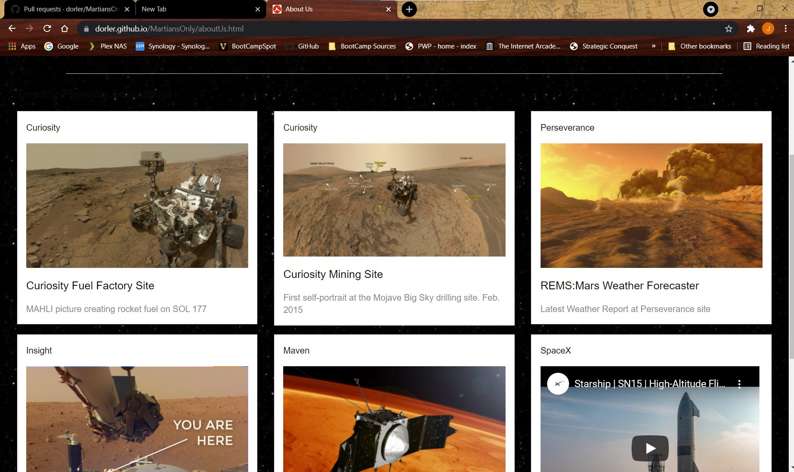

# MartiansOnly

## John Mohlenkamp
## June 6, 2021

## GitHub Location: https://github.com/Mohlenkamp/MartiansOnly

## GitPages Location: https://dorler.github.io/MartiansOnly/index.html

## Description
### This is a group project that developed a website based on using the NASA Open API architecture to allow users to search and view various Mars-related images and videos. The user story is that we are prototyping a Mars flight page to book passengers. Most of the project related information (Kanban, issues, Wiki, Contributors, etc... should be retrieved from the project leader's public github site: https://github.com/dorler/MartiansOnly

